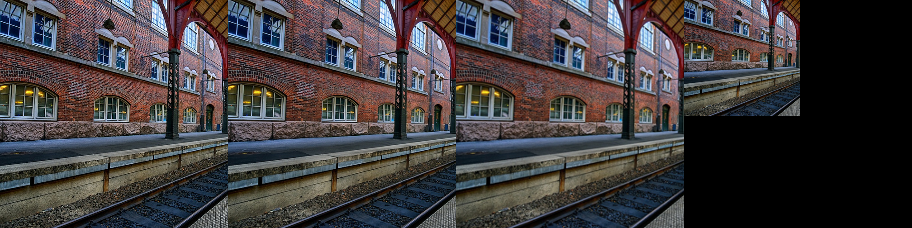

# Image Upsampling with PyTorch

This project trains an image upsampling model using PyTorch and the Microsoft DeepSpeed framework. The model is designed to increase the resolution of images by a factor of 2.  For the most part this is currently a replication of the results of the authors of the VapSR ( https://github.com/zhoumumu/VapSR ) super-resolution model in my own training framework.

Technology explored in this project:

* Image upsampling model training and evaluation with PSNR, SSIM, and LPIPS.
* Dataset construction with multi-threaded Python tools.
* Loading training data from image folders, video files, and ImageNet dataset.
* Data loading with Nvidia DALI - Benchmarked nvJPEG2000, WebP, and PNG for lossless loading.
* Model optimization with TorchDynamo and Inductor.
* Model training with DeepSpeed, Accelerate and DistributedDataParallel using NCCL backend across a LAN cluster of nodes each with multple GPUs.
* Evaluated whether OKLAB/YUV colorspace improves model performance.
* Ablation study of different network architectures and training strategies.
* Exploration of ImageNet and other normalization strategies, and in-network normalization.
* Exploration of L1, L2(MSE), and LPIPS loss functions.
* Conversion to ONNX and OpenVINO IR model formats and execution on Intel CPU/GPU.


## Example



Left: Original Image.  Second: My model output.  Third: Bicubic upsampler.  Right: Input image.


## Prerequisites

- Linux
- Python 3.8 or higher
- Conda
- Ffmpeg
- Nvidia GPU


## How-To

1. Clone this repository.

```bash
sudo apt install ffmpeg gcc-11 g++-11 libopenmpi-dev

git clone https://github.com/catid/upsampling.git
cd upsampling
```


2. Create a new conda environment and install dependencies:

```bash
conda create --name upsampling python=3.8
conda activate upsampling

# Update this from https://pytorch.org/get-started/locally/
pip3 install torch torchvision functorch --extra-index-url https://download.pytorch.org/whl/cu118

# Update this from https://github.com/NVIDIA/DALI#installing-dali
pip install --extra-index-url https://developer.download.nvidia.com/compute/redist --upgrade nvidia-dali-cuda110

pip install -r requirements.txt
```

Note that the default location for the dataset will be at ~/dataset for all the scripts.


3. Extract training images from a folder of image files:

For training I used just the training sets from these datasets: DIV2K, Flickr2K, KODAK, Sunhays80.  The validation sets are not used for fair comparison to other algorithms.  You can grab these datasets from my Google Drive: https://drive.google.com/drive/folders/1kILRdaxD2o273E2NnrXzhaLbQCXDxz9l?usp=share_link

To incorporate one of these training sets into the dataset, create a directory containing only the `*_HR.png` images.

```bash
# Use the example KODAK dataset included with this repo under kodak/
python images_to_data.py kodak ~/dataset/kodak
```

Random crops are taken at different scales.

We do not 2x downsample PNG images because they are lossless images without chroma subsampling. The default is to 2x downsample JPEG input images because most images are 4:2:0 chroma subsampled and have some compression artifacts.


4. Validate the training data to verify that all images are the same size.

```bash
# Print a list of all the data that is included in the dataset, to make sure nothing was accidentally left out
python list_data_folders.py

# Check the dataset for any images that are too small to use or truncated, and delete them
python check_training_data.py --fast --clean
```

You can remove the `--fast` parameter to do full image decoding during the check, but it is about 100x slower.

The `--clean` parameter will remove all the images that are too small or too large to be used.  We currently train on random 256x256 crops of the input images in each epoch, so the files need to be bigger than that.  They need to be smaller than about 2048x2048 to avoid crashing DALI during loading.


5. Check training:

Select the training/validation files to use from the dataset:

```bash
python select_training_files.py
```

In the `~/sources/upsampling` directory of each node, launch training locally to verify that it can run well using multiple GPUs:

```bash
./launch_local_train.sh --reset
```

6. Train using the whole GPU cluster:

Update the `hostfile` to include all the nodes on your network.
Modify the `launch_distributed_train.sh` script to use the correct number of GPUs and nodes.

```bash
./launch_distributed_train.sh --reset
```

To stop training just hit CTRL+C at any time, and when you run it again without the `--reset` argument it will resume from where it left off:

```bash
./launch_distributed_train.sh
```

To watch the Tensorboard:

```bash
./run_tensorboard.sh
```

Export the model to PyTorch .pth format:

```bash
python export_trained_model.py
```

This produces a file named `upsampling.pth` in the current directory.


7. Evaluate the trained model:

```bash
python evaluate.py
```

This evaluates the model on the Urban100 dataset in this repo under `urban100/`.  The side-by-side results are saved to `outputs/`.


8. Export model to ONNX so that it can be used in other frameworks:

```bash
python convert_to_onnx.py
```


## Results

For the following results we use validation loss as the metric for model selection.  We stop training after 100 or 200 epochs with no improvement in validation loss, so these are all fully trained.

I tried converting from RGB to another perceptually uniform colorspace inside the network, but it did not improve the results.  My conclusion is that using the native colorspace of the training data is the best option:

```
YUV PSNR: 29.25841712579564
OKLAB PSNR: 29.416221449440155

RGB:
commit 684cdf6f2a31af9311b20792e10afea80082892a
Trained for 41M iterations
2023-05-10 15:29:32,658 [INFO] Model PSNR: 30.183498600102137 - Bicubic PSNR: 24.87192185623686
2023-05-10 15:29:32,658 [INFO] Model SSIM: 0.9237528208169244 - Bicubic SSIM: 0.8233347716777945
2023-05-10 15:29:32,658 [INFO] Model LPIPS: 7.562230394501671e-05 - Bicubic LPIPS: 0.0013645301913965267
```

I used the VapSR upsampling network for my project since it is the best "small" model I could find, and it uses some modern ideas like attention.  I tried modifying the VapSR network to use 3x3 convolutions instead of pointwise 1x1 convolutions in the residual blocks, and it improved the results significantly for such a small change.  The network is 10% slower but has about 4% higher quality, which is a good tradeoff:

```
Conv2D-3x3 for each block
commit e05fb91dcc9948f343d44a9747b0564ce47289ad
2023-05-11 00:53:21,679 [INFO] Model PSNR: 30.419869491633694 - Bicubic PSNR: 24.87192185623686
2023-05-11 00:53:21,679 [INFO] Model SSIM: 0.9261785885967156 - Bicubic SSIM: 0.8233347716777945
2023-05-11 00:53:21,679 [INFO] Model LPIPS: 6.864146791633323e-05 - Bicubic LPIPS: 0.0013645301913965267
```

I tried training the model using full FP32 precision instead of FP16 and found that it improved performance but only slightly so does not seem worth the extra effort:

```
FP32
commit 1241bad70f747ab3debc2b0295c4de92a1a0086e
2023-05-11 15:38:53,131 [INFO] Model PSNR: 30.42989522500928 - Bicubic PSNR: 24.87192185623686
2023-05-11 15:38:53,131 [INFO] Model SSIM: 0.9264403109565023 - Bicubic SSIM: 0.8233347716777945
2023-05-11 15:38:53,131 [INFO] Model LPIPS: 6.918588840497184e-05 - Bicubic LPIPS: 0.0013339655822680986
```

I tried using MSE loss instead of L1 loss and found that it did not improve the results, so ended up sticking with L1 loss.

```
MSE loss
commit b27d12c527385b2014b83566be105f839fe51327
2023-05-11 22:40:08,426 [INFO] Model PSNR: 30.103380391483654 - Bicubic PSNR: 24.87192185623686
2023-05-11 22:40:08,426 [INFO] Model SSIM: 0.9215354474245302 - Bicubic SSIM: 0.8233347716777945
2023-05-11 22:40:08,426 [INFO] Model LPIPS: 7.704998459073747e-05 - Bicubic LPIPS: 0.0013645301913965267
```

I also tried LPIPS loss and mixes of LPIPS and L1 loss, but they did not improve the results either (results not shown).

During training, I was only randomly flipping the images horizontally, but I found that adding random 90 degree rotations improved the results significantly almost 0.1 dB, though training took longer.

```
Image rotations in data loader
2023-05-12 16:57:25,203 [INFO] Model PSNR: 30.532850187551094 - Bicubic PSNR: 24.87192185623686
2023-05-12 16:57:25,203 [INFO] Model SSIM: 0.9269711264478881 - Bicubic SSIM: 0.8233347716777945
2023-05-12 16:57:25,203 [INFO] Model LPIPS: 6.968190243102842e-05 - Bicubic LPIPS: 0.0013645301913965267
```

The gap between bicubic and model is about the same (5.66) as the VapSR paper (5.57), so I consider these results to replicate their success, though the actual numbers are different for some reason.  I did use a slightly larger model to get this higher quality, but it's a change that the authors did not consider in their paper, and I consider it to be an improvement.


## OpenVino Inference

Follow README instructions in the [OpenVino](openvino/) directory.


## License

This project is licensed under the [MIT License](LICENSE).
