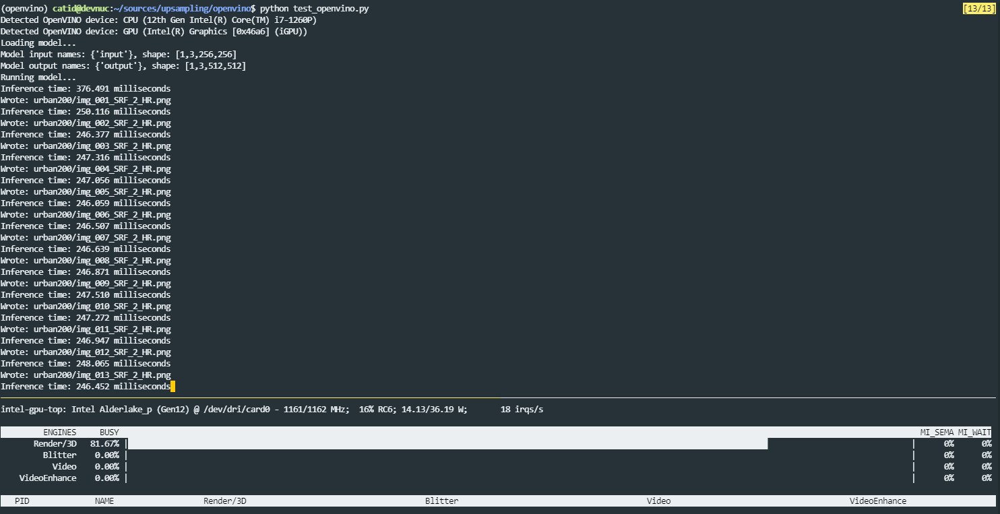

# OpenVINO

This is split into another project because it requires a different environment than the rest of the project.  The rest of the project uses PyTorch and CUDA, but OpenVINO uses the Intel GPU and a different model format.

Since this is a small model, it should work well with OpenVINO.  In my testing, OpenVINO runs about 2x faster than CPU, and uses the integrated GPU in Intel CPUs that is often ignored.  This means that it should run fast on laptops or other devices that are somewhat resource constrained, without taking resources away from other applications.

## Setup

For testing I'm using an Intel NUC (no GPU) running latest Ubuntu Server 22.10.  It's possible that to use the iGPU you'll need to modify your BIOS or attach a Headless Ghost ( https://www.headlessghost.com/ ) to get the device to show up if you have an Nvidia GPU installed in the computer.

Install latest OpenVINO drivers for Ubuntu from https://github.com/intel/compute-runtime/releases and :

```bash
mkdir neo
cd neo
wget https://github.com/intel/intel-graphics-compiler/releases/download/igc-1.0.13463.18/intel-igc-core_1.0.13463.18_amd64.deb
wget https://github.com/intel/intel-graphics-compiler/releases/download/igc-1.0.13463.18/intel-igc-opencl_1.0.13463.18_amd64.deb
wget https://github.com/intel/compute-runtime/releases/download/23.09.25812.14/intel-level-zero-gpu-dbgsym_1.3.25812.14_amd64.ddeb
wget https://github.com/intel/compute-runtime/releases/download/23.09.25812.14/intel-level-zero-gpu_1.3.25812.14_amd64.deb
wget https://github.com/intel/compute-runtime/releases/download/23.09.25812.14/intel-opencl-icd-dbgsym_23.09.25812.14_amd64.ddeb
wget https://github.com/intel/compute-runtime/releases/download/23.09.25812.14/intel-opencl-icd_23.09.25812.14_amd64.deb
wget https://github.com/intel/compute-runtime/releases/download/23.09.25812.14/libigdgmm12_22.3.0_amd64.deb

sudo dpkg -i *.deb

sudo apt install clinfo

sudo usermod -a -G render $USER
sudo usermod -a -G video $USER

# Reboot server
sudo reboot now

# Test OpenCL
clinfo
```

You'll need [conda](https://docs.conda.io/projects/conda/en/latest/user-guide/install/linux.html) installed for the next steps:

```bash
conda create -n openvino python=3.10
conda activate openvino

# Install OpenVINO
pip install -r requirements.txt
```

## Convert Model to OpenVINO Format

At the end of training (see main README), you should have an `upsampling.onnx` file.

```bash
python convert_model.py
```

This produces the `./openvino_model` directory with the model in OpenVINO format.


## Test Inference with Intel GPU

Note that OpenVINO Intel GPU mode has a limitation that it cannot change the input resolution without re-loading the model.  So when processing multiple files, it's helpful to have all the images be the same dimension.

```bash
OV_GPU_CACHE_MODEL=1 python test_openvino.py
```

You can monitor GPU usage with `intel_gpu_top`:

```bash
sudo apt install intel-gpu-tools
sudo intel_gpu_top
```


## Results

For a 256x256 8-bit RGB image => 512x512 output 8-bit RGB image:

On CPU:

```
Inference time: 461.398 milliseconds
```

On GPU:

```
Inference time: 247.611 milliseconds
```

So the Intel GPU is almost twice as fast as the 16-core CPU when using vector instructions.

The result should look like this:




## License

This project is licensed under the [MIT License](LICENSE).
